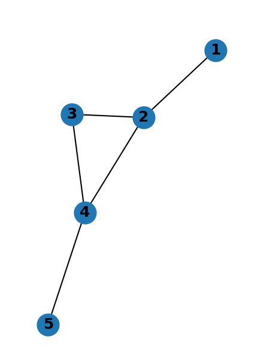

# Breadth-First Search Algorithm on Graphs

This repository contains a Python implementation of the Breadth-First Search (BFS) algorithm applied to graphs. The BFS algorithm is a fundamental algorithm used for traversing or searching tree or graph data structures. In this implementation, the algorithm is applied to find the shortest path between two nodes in an undirected graph.

## Requirements
- Python 3.x
- NetworkX
- Matplotlib

## Usage

1. Install the required libraries using the following command:
   ```bash
   pip install networkx matplotlib

2. Run the Script
   ```bash
   python bfs_graph_search.py

3. Enter start and end nodes when prompted, following the format a b. To exit the program, type 'exit'.

## Graph Representation
The graph is represented using the NetworkX library. Examples of graph configurations are provided in the code, and you can uncomment/comment the corresponding lines to test different graph structures.

## BFS Algorithm
The BFS algorithm is implemented as a function bfsearch(graph, v, w) that takes a graph, start node (v), and end node (w) as parameters. The function returns whether a connection exists and the path if found.

## Example Graph


Input: (1 5)
Output: Connection found. Path: [1, 2, 4, 5]
